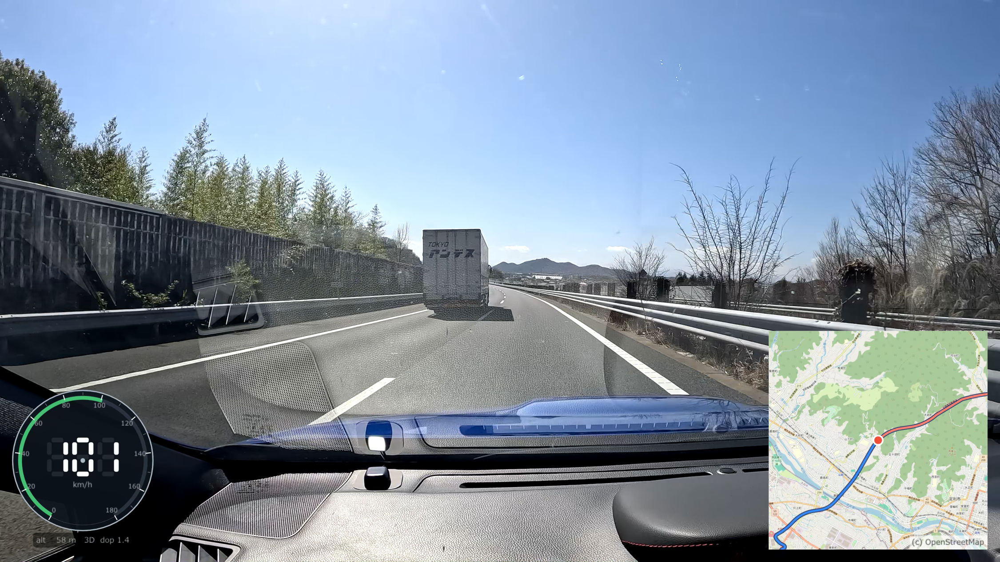

<div align="center">

# `RouteCam`

<b> View and transcode action-camera footage (GoPro HERO / Max 2) with a GPS speed gauge and OpenStreetMap route overlay </b>

[](https://github.com/James2022-rgb/routecam/actions/workflows/build.yml)
[](https://github.com/James2022-rgb/routecam/releases/latest)



</div>

---

- **Playback**: flat HEVC MP4s and GoPro Max 2 `.360` (dual-track EAC, drag to look around), HDR10 output, GPMF telemetry overlays.
- **Transcode**: burns the overlays into a re-encoded MP4 with Vulkan Video; `.360` sources are reframed to the current view. AAC audio passes through.

Map data (c) [OpenStreetMap](https://www.openstreetmap.org/copyright) contributors.

## Build

Windows x64, MSVC (VS2022), CMake >= 3.22, Rust (`cargo`) on PATH, Vulkan SDK.
See [CLAUDE.md](CLAUDE.md) for the submodule initialization recipe (do NOT init recursively).

```
cmake -S . -B build-win_x64
cmake --build build-win_x64 --target routecam --config Release
```

Run from the repo root (or next to an `assets/` directory):

```
build-win_x64\Release\routecam.exe [video.MP4]
```
